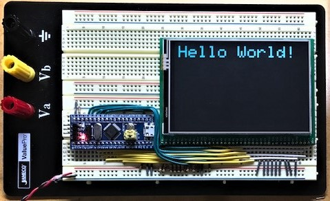

# STM32_ILI9486_8_bit
This is a library for ILI9486 based TFT displays controlled by an 8-bit parallel port (8080) interface for STM32duino.

Based on the original [Adafruit 8-bit parallel TFT library](https://github.com/adafruit/TFTLCD-Library) written by Limor Fried/Ladyada and ported to STM32duino by Mike Kushnerik/MKE.

This library depends on the ST HAL based Arduino core files from here: [STM32duino](
https://github.com/stm32duino/Arduino_Core_STM32)

The goal of this library was to create a simple to use display interface for the 3.5" and 4.0" ILI9486 TFT displays which is also compatible with the [Adafruit GFX API.](https://github.com/adafruit/Adafruit-GFX-Library)

So far, this library has been tested using my 3.5" and 4.0" TFT breakout boards available here: [TFT Breakouts](https://github.com/mkengineering/8-16-Bit-TFT-Breakout)

3.5" and 4.0" ILI9486 displays for the breakouts can be purchased here: [AliExpress](https://www.aliexpress.com/store/704833?spm=a2g0o.detail.100005.2.150b4202kjnpHN)

Benchmark using 4.0" 480x320 ILI9486 based LCD and STM32F103C8T6 Blue Pill @ 72 MHz:

| Benchmark | Time (microseconds) |
| --- | --- |
| `Screen fill` | 129963 |
| `Text` | 19215 |
| `Lines` | 315618 |
| `Horiz/Vert Lines` | 14080 |
| `Rectangles (outline)` | 9339 |
| `Rectangles (filled)` | 357961 |
| `Circles (filled)` | 130584 |
| `Circles (outline)` | 131883 |
| `Triangles (outline)` | 60204 |
| `Triangles (filled)` | 180752 |
| `Rounded rects (outline)` | 43843 |
| `Rounded rects (filled)` | 383875 |

How to use:

1. Place the Adafruit_TFT library folder your <arduinosketchfolder>/libraries/ folder. Restart the Arduino IDE.
1. If not already installed, add the [Adafruit GFX Library](https://github.com/adafruit/Adafruit-GFX-Library) to your libraries folder.
1. Modify pin settings as necessary for your application. Make sure to read the notes regarding pin assignments inside the "STM32_ILI9486_8_bit.h" file.
1. Enjoy! :grinning:
